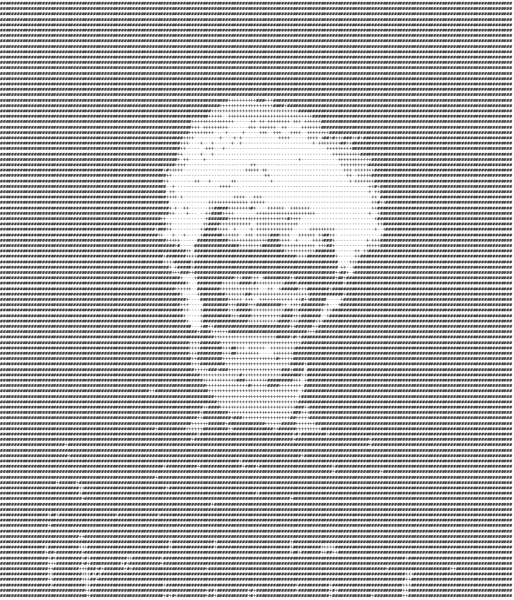

<div align="center">

</div>

<br><br>

<details>
<summary><b>▶</b> &nbsp;<code>run about.sh</code></summary>

<br>

<div align="center">

</div>

<br>

```
$ cat about.md

second-year b.tech, ai & ml
vnr vignana jyothi institute of engineering & technology
2024 – 2028  ·  cgpa 9.30

focus     computer vision, agritech, agentic systems
motto     build first, understand later
past      full-stack dev intern @ nirvaha · open-source contributor, gssoc 2025
based in  hyderabad, india
```

</details>

<br>

<details>
<summary><b>▶</b> &nbsp;<code>tail -f now.log</code></summary>

<br>

```
[2026-07]  retraining AerialVision from scratch —
           closing a train/inference gap in SAHI
           sliced inference. Swin Transformer +
           Faster R-CNN on MMDetection, BoT-SORT
           for tracking.

[2026-06]  shipped Amazon Outcome Intelligence
           at HackOn With Amazon 6.0.

[ongoing]  reading restoration-CV papers —
           Retinexformer, DRSformer.
```

</details>

<br><br>

<h3>stack</h3>

<code>Python</code> <code>TypeScript</code> <code>JavaScript</code> <code>React</code> <code>Node.js</code> <code>PyTorch</code> <code>MMDetection</code> <code>PostgreSQL</code> <code>Docker</code>

<br><br>

<h3>projects</h3>

**AerialVision** — aerial object detection & tracking. Swin Transformer + Faster R-CNN via MMDetection, BoT-SORT for tracking, SAHI for sliced inference on dense scenes.
<sub><code>mmdetection</code> <code>pytorch</code> <code>sahi</code></sub>

**KrishiMitra** — a farmer-facing agritech platform pairing traditional Indian UI motifs with modern tooling. Top 10, Hackfiniti National Hackathon 2025.
<sub><code>react</code> <code>node</code> <code>mongodb</code></sub>

**Gamana** — AI-driven traffic control, exploring real-time signal optimization at urban intersections.
<sub><code>python</code> <code>computer vision</code></sub>

<br><br>

<div align="center">


</div>

<br>

<div align="center">

</div>

<br><br>

<div align="center">

<sub><a href="https://linkedin.com/in/srikaranreddy">linkedin</a> &nbsp;·&nbsp; <a href="mailto:mail2srikaran@gmail.com">email</a> &nbsp;·&nbsp; <a href="https://github.com/Sriikaran">github</a></sub>

<br><br>

<sub>currently building AerialVision · open to interesting problems</sub>

</div>
